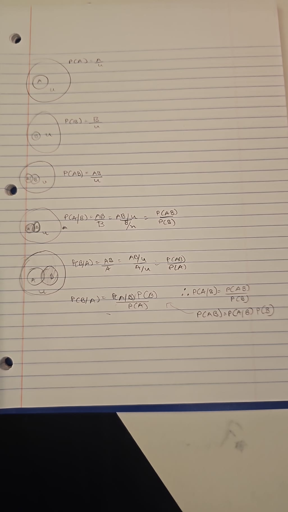

this file contains homework 5.
this file contains homework 5.
1) All data visualizations map data values into quantifiable features of the resulting graphic. We refer to these features as aesthetics. some of them are position, shape, size, line width, etc.  
2) continuous and discrete.  
3) quantitative and qualitative.  
4) categorical.    
5) ordered - size, width, area.  unordered - shape, colour, style.  
6) Month: qualitative, Categorical, Discrete, Ordered.     
Day : Quantitative, Numerical, Discrete, Ordered.     
Location: qualitative, Categorical, discrete, Unordered.     
Station ID: qualitative, Categorical, discrete, Unordered.     
Temperature:Quantitative, Numerical, Continuous, Ordered.  
7) coordinate axes in a plot should be represented with the same units and grid size.
8) there is the slide in the lecture notes where we had saw the data of Areas of north eastern american states where we had transformed the linear scale into square root scale.
9) 2nd.
10) polar coordinates.
11) qualitative color scale: a means to distinguish discrete items or groups that do not have an intrinsic order, such as different countries on a map or different manufacturers of a certain product.   
  Color can also be used to represent data values, such as income, temperature, of speed. In this case, we use a sequential color scale.   
  In some cases, we need to visualize the deviation of data values in one of two directions relative to a neutral midpoint. in this case we use diverging color scale.  
  Color can also be an effective tool to highlight specific elements in the data. this can be done through accent color scale.
13) for humans 1st one is better for visulization.  
14) 2) honolulu is hotter.    
    3) honolulu has less flactuating temprature.     
    4) the only correlation with the temprature is it reduces and increases but the thing is different for both cities in which one of them gets a bit colder and honolulu stays hotter by just reducing to a certain level.   
    5) -     
17) Classical Probability, bayseian probablity, frequentist probablity, propensity.   
18)   
19) 4) out of these 2 second one is the  best model for better representation of reality. And also second one predicts more risen in temprature in the future.      
20) ther are 2 animals which is visible to me which are forg and if we concentrate more and start it from the top we can also see a horse.
21) I will pick the bottom left mathstick from '8' by making it '9' and then put it in middle of '0' making it an '8'. so the equation would be 9 + 3 - 4 = 8.    
 .  
